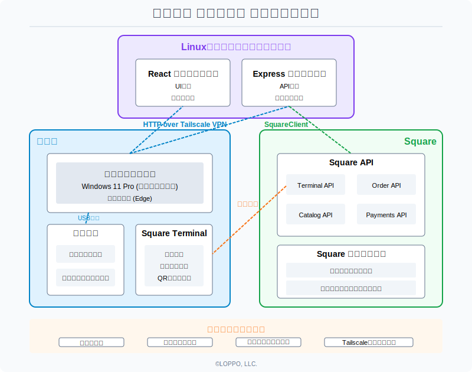

# LOPPO Register

Square APIベースの完全キャッシュレスPOSシステム


## 概要

LOPPO Registerは、Square APIを活用した無人販売所向けのセルフレジシステムです。  
24時間365日稼働する無人店舗運営を可能にします。

### 主な特徴

- **完全キャッシュレス**：クレジットカード、交通系IC、iD、QUICPay、QRコード決済に対応
- **マルチ言語対応**：日本語、英語、フランス語、スペイン語、繁体字中国語、簡体字中国語、韓国語の7言語
- **シンプルなインターフェース**：直感的な操作で客層を選ばず使いやすい
- **低コスト運用**：月額固定費なし（決済手数料のみ）、Square Terminalのみで運用可能
- **リモート管理**：商品管理やデータ分析がSquareダッシュボードから可能

## ⚠️ セキュリティー等に関する注意事項

**このシステムを本番環境で使用する前に必ず以下の対策を行ってください。**

1. **VPNの構築**：
   - このシステムは初期状態では通信が保護されません
   - 各サーバーとキオスク端末間の通信を保護するため、Tailscaleなどでプライベートネットワークを構築することを強く推奨します

2. **サーバーの冗長化**：
   - [forever](https://www.npmjs.com/package/forever) などでアプリをデーモン化し、異常終了時に再起動することを強く推奨します

3. **物理的セキュリティー**：
   - クライアント端末は物理的に保護された環境に設置してください
   - 不正アクセスや機器の操作を防止するため、適切なケースやマウントを使用してください

4. **停電・ネットワーク障害対策**：
   - 無停電電源装置(UPS)を用意し、電源の安定供給を確保してください
   - ネットワークの冗長化（モバイルルーターなど）を検討してください

5. **監視カメラの設置**：
   - 不正行為防止と遠隔監視のために監視カメラの設置を強く推奨します

## 前提条件

- Square開発者アカウント
- Square Terminal（または互換端末）
- クライアント端末（キオスクモード用）
   - 推奨：Windows 11 Pro
- サーバー端末（アプリケーションホスティング用）
   - 推奨：Linux
   - Node.js 16.x以上
   - npm 7.x以上

## セットアップ手順

### 1. Square API設定

1. [Square開発者ダッシュボード](https://developer.squareup.com/)でアカウントを作成
2. アプリケーションを作成し、APIキーを取得
3. Square Terminalを登録し、デバイスIDを取得

### 2. 環境設定

```bash
# リポジトリをクローン
git clone https://github.com/loppo-llc/loppo-register.git
cd loppo-register

# 環境設定ファイルを作成
cp .env.sample .env
# .envファイルにSquare APIキー等を設定
```

`.env`ファイルを編集して、必要な環境変数を設定します。

```
# Square API 設定
SQUARE_ACCESS_TOKEN=your_square_access_token
SQUARE_LOCATION_ID=your_square_location_id
SQUARE_DEVICE_ID=your_square_terminal_device_id

# 商品カテゴリーフィルター設定
SQUARE_CATEGORY_FILTER=

# サーバー設定
PORT=3000
NODE_ENV=production
```

### 3. インストールと実行

APIサーバーとWEBサーバーは別プロセスで起動してください。  
初期状態では、それぞれポート3000と3001番で起動します。  
起動後、 `http://localhost:3001/` を開くことでアプリケーションを確認できます。

```bash
# 依存関係のインストール
npm install
npm run install-client

# APIサーバー起動
npm start

# WEBサーバー起動
cd client
npm run dev
```

### 4. Windowsクライアント設定

1. Windows 11 Proでキオスクモードを設定
2. 起動時に自動的にブラウザを開くよう設定
3. ブラウザのアドレスをサーバーのIPアドレスに設定

## アーキテクチャー



## トラブルシューティング

**Q: Square Terminalが応答しない**  
A: デバイスIDが正しいことを確認してください。Terminalの電源をON/OFFし、ネットワーク接続を確認してください。

**Q: 決済が失敗する**  
A: Square Terminalのステータスを確認し、必要に応じて再起動してください。

**Q: システムが応答しない**  
A: アプリケーションが起動しているサーバーのローカルIPアドレスを確認してください。クライアント端末とサーバーを再起動し、VPN接続を確認してください。

## カスタマイズ

### 言語設定

`client/src/App.jsx`の`translations`オブジェクトで各言語の翻訳を編集できます。

### 商品管理

すべての商品はSquareダッシュボードから管理します。変更はAPIを通じて自動的に反映されます。

## ライセンス

当プロジェクトはMITライセンスで公開されています。詳しくは[LICENSE](LICENSE)をご覧ください。

## 関連リンク

- [Square開発者ドキュメント](https://developer.squareup.com/docs)
- [セルフレジシステムの開発ブログ記事](https://blog.loppo.co.jp/full-self-checkout-system/)

## サポート

問題や質問がある場合は、Issueを作成してください。機能追加やバグ修正のPull Requestも歓迎します。
